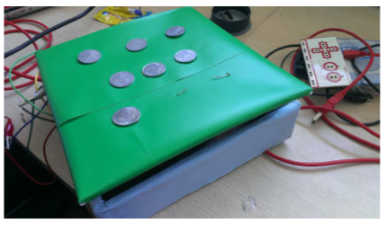

##Note Code (aka Musicode)

To learn programming by playing around with making music.

###Instructions:

The first question, as you can see, is to play "0 1 2".
To do this, follow this steps:

1. Press g. //This begins recording the program to be fed in function 1
2. Press a. //This is note 0
3. Press b. //This is note 1
4. Press c. //This is note 2. As you were pressing each of the notes, it should come under the Function 1 column, as note 0, note 1, and note 2.
5. Press p. //This is the play button. When a function is being recorded, it is used to stop recording that function. When no functions are being recorded, it is used to play/stop the stored program.
6. Press p again. //This time, to play the program.

7. Press m to go to the next question.
8. After you solve this, press m to go the next 1.

The following's the sub-optimal solution we showed the kids we tested with (who had no programming experience or knowledge earlier, and we cursorily tried to explain them functions), and asked them to find a more optimal solution by exploring.

1. Press h. //This begins recording function 2.
2. Press b. //Note 1.
3. p //Strop recording function 2
4. g //Function 1
5. a - h - a - h - a - h //Pressing g or h inside another function puts a function call.
6. p - p

We just put in 6 notes on the buttons a-f = 0-5. And only 0-4 are used in the few entered puzzles, so they're the only ones in progression from a C note to a G note.

We did create a system of conditionals, where keys 1-4 'call edges' 1 to 4, and 5-8 'check for edges'.
This was supposed to couple into the tangible part of the system. We made the kids use our 'tangible' box instead of the keyboard. Which was essentially just a wooden box with coin-like buttons, and a MaKeyMaKey udnerneath (after a lot of failing with other Arduino solutions), and the buttons were labeled according to their function.
Ideally, this boxes were supposed to have the ability to communicate when put in adjacency. For this, we would send 'HIGH' signals from an Arduino to the 'side that had been called'. During play, this would trigger an event on the receiving box, that it received a signal on this particular edge. If it was looking for an if at this time beat, it would enter the condition's content, else it wouldn't.
We managed to make this work for the most part, except it was quite tough to attain perfect time synchrony. And every box needed a computer along with it for this GUI, so these tangibles were anyway not flexible enough to be standalone. After some basic trying, we also realized that we would not have enough time to introduce conditions, let alone get the chance for the kids to understand the same, so we left it.

We've been imagining, that maybe if we put in a lot of effort into making this purely GUI-based, perhaps a tablet app – especially by finding some clever way of getting the conditions to work as nicely or better than what we'd imagined with the boxes, it might be worth it. In this thread of thought, we were imagining doing something about the limited number of notes, as well as provide more instruments as well. Do you think this concept is worth attempting to go ahead with? Any suggestions on how you'd make it better, or make it at all?